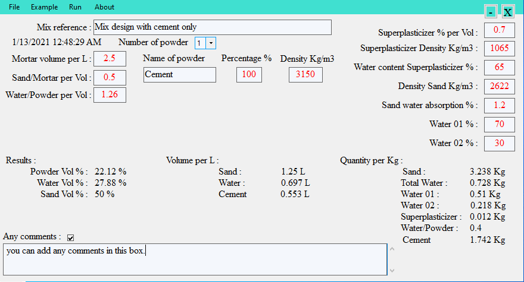

# self-compacting-mortar
### you can fellow these images how to use the application from input through results and output file in two format (txt and doc).
### The first window by which language you want you use.

### The main window where you can put inputs and get the results by click on put examples from the menu:

### Then, you can run the calculation by clicking on run in the menu up as shown in the image bellow:

### You can see the results down in the main window and you can add any comments to the case as shown in the image bellow:

### Finally, you can export the case in two format (doc and txt) and save the file where you want:

### Bellow and exmple of exported file:

